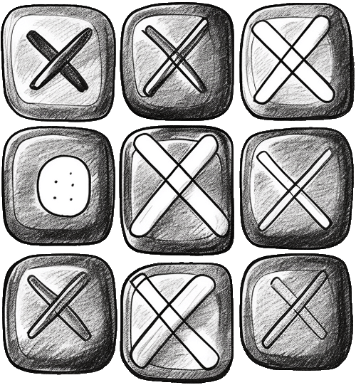
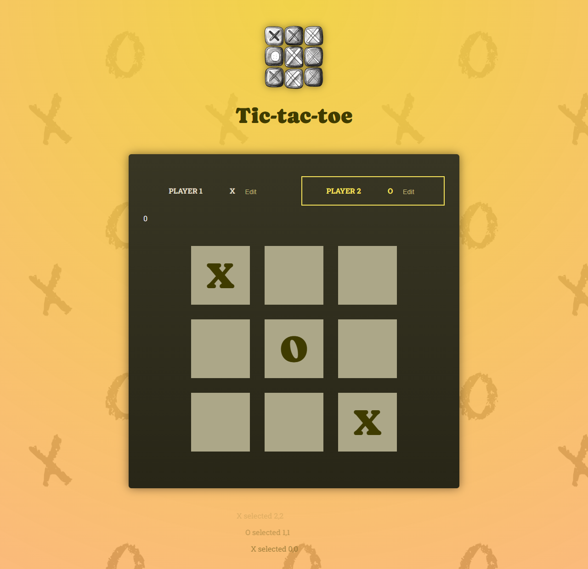

# React Tic-Tac-Toe

A simple tic-tac-toe game built with React and Vite. Players can edit their names, take turns on a 3x3 board, track each move, and restart when the match ends.





## Features

- Classic 3x3 tic-tac-toe gameplay.
- Editable names for Player 1 and Player 2.
- Active player highlighting.
- Move log that records every selected square.
- Automatic winner and draw detection.
- Rematch button after each finished game.
- Custom tic-tac-toe favicon.

## Installation

To get started with React Tic-Tac-Toe, follow these steps:

1. Clone the repository:

   ```bash
   git clone https://github.com/hristianivanov/tic-tac-toe-demo-project.git
   ```

2. Navigate to the project directory and install the dependencies:

   ```bash
   cd tic-tac-toe-demo-project
   npm install
   ```

3. Start the development server:

   ```bash
   npm run dev
   ```

Your game should now be running locally, accessible through your browser at `http://localhost:5173` by default.

## Contributions

Contributions are welcome. Feel free to open an issue or submit a pull request with improvements.

## License

This project is open source and available under the MIT License.
